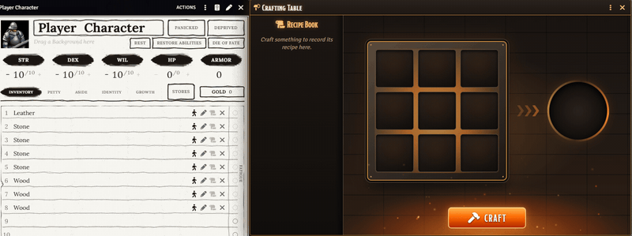
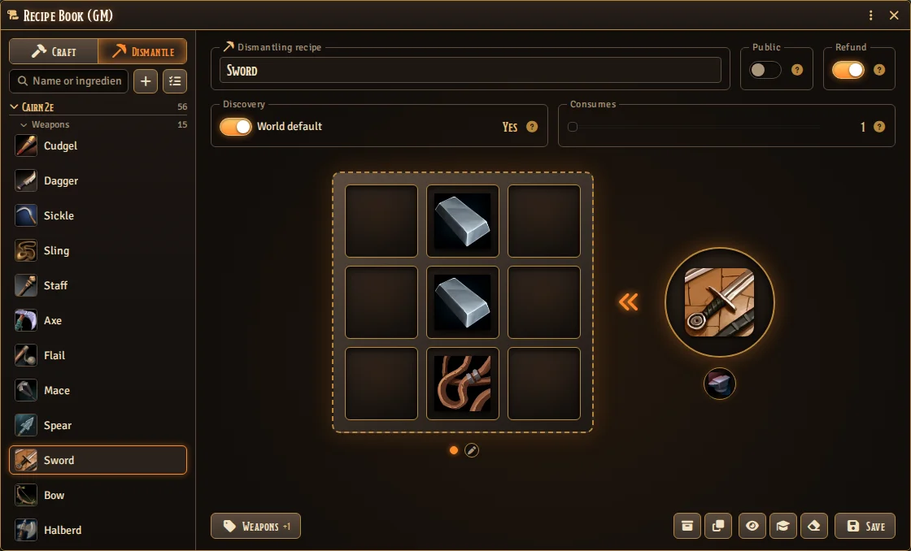
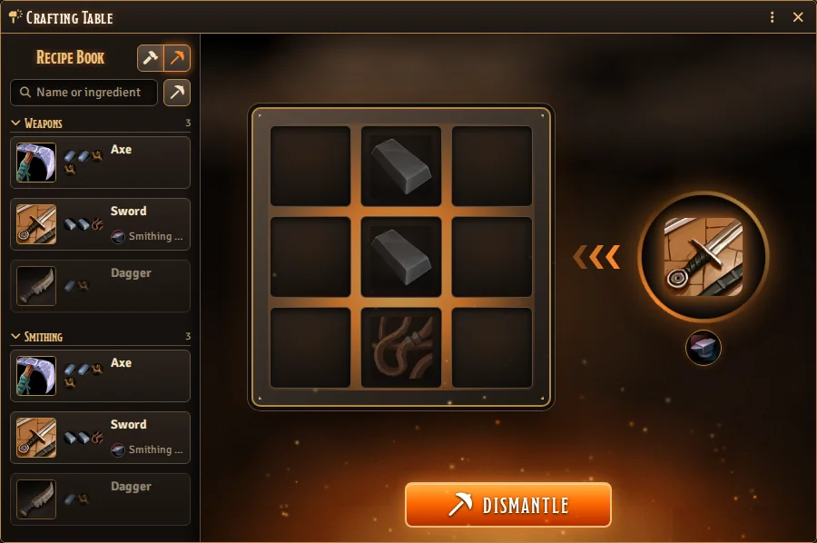

# Grid Crafter

Grid Crafter puts a crafting table in any Foundry system. Players lay items from their character's
sheet on a 3×3 grid, press **Craft**, and if the layout matches a recipe the materials leave the
sheet and the new item lands on it: two iron ingots over a stick make a sword. The GM writes the
recipes once, and the table animates every craft with sparks, light and the ring of the anvil.




[](https://buymeacoffee.com/mestredigital) [](https://mestredigital.online/pages/projetos-en)

## Why use it

The fighter wants a new sword. The player says *"I use the two iron ingots and the wood I found."*

Then the game stops. Is that even a recipe? The GM checks their notes, the player deletes the ingots
from the sheet by hand (or forgets to), someone creates the sword item, someone else asks where the
wood went. Making the sword turns into bookkeeping.

With Grid Crafter, the GM sets up the recipes once. The players drag items from their own sheets onto
a crafting grid and try their luck. Get it right, and the ingots and the wood leave the sheet, the
sword appears on it, and the whole table sees it happen in chat. Get it wrong, and the materials don't
come together, and if the GM wants, they can be lost in the attempt.

## What it does

- Players drag items from their character's sheet onto a 3×3 grid, move them between cells, and
  press **Craft**. Double-clicking an item opens its sheet. The GM can also use items straight from
  the Items directory or a compendium.
- Every craft is animated. The table shakes with three hammer blows, the materials fly into the
  middle of the grid, a flash of light travels into the result slot, and the new item comes out of
  it. A failure flares red, shakes and smokes.
- The GM picks one of two themes for everyone. Forge has fire, sparks, riveted iron and the ring of
  the anvil. Arcane has runes, a turning magic circle and blue light.

  

- Recipes are shaped or shapeless. A shaped recipe cares where each item sits, and still works
  anywhere on the grid. A shapeless recipe only cares which items are there. A recipe can have up to
  four variants, each a different way to make it with its own layout and its own required tool, so
  the stone axe and the iron axe are one recipe, and a character who learns it learns every variant.
  One layout never makes two different recipes.
- Crafting uses the real inventory. It spends one unit per grid cell from the character's own sheet,
  and the new item lands on that sheet, stacking with any copies already there. Systems with slots or
  weight limits are respected: the materials make room for what they become, and if the result still
  doesn't fit, nothing is spent.
- Every character has a recipe book. The first time a character forges something, or when the GM
  teaches it, its recipe is written into that character's book. Next time, one click lays the recipe
  out on the grid from their inventory. Recipes are grouped by category, and the book can be searched
  by name or ingredient, or narrowed to what the character can craft right now. A recipe the GM makes
  public is in every character's book.
- Dismantling recipes break an item back into parts: one item in, up to nine parts out, and an
  optional tool the character must carry. Turn the crafting table around, put the sword in the
  circle, press **Dismantle**, and the ingots and the stick fly out onto the grid as items on the
  sheet, ready to craft with. Characters know, learn and discover dismantling recipes the same way
  as any other, and every dismantle is reported in chat. If the parts don't fit on the sheet,
  nothing is spent.
- A character can make a recipe they don't know by laying out its ingredients, and learns it by
  doing so. The GM can turn this discovery off for the whole world or for single recipes, and then
  only recipes a character already knows can be crafted.
- From the GM's Recipe Book, **Share** shows a recipe to the players you choose: its pattern lights
  up cell by cell, then what it makes appears. Each of them can **Learn** it into their own
  character's recipe book.
- A failed attempt can cost something. Set a chance for it to destroy the materials, for the whole
  world or per recipe. Leave it at 0 and failure is free.
- Every attempt is reported in chat. Success shows what was spent and what was made; failure shows
  what was tried; a result the character had no room for shows that nothing was spent. Items the GM
  took from the Items directory or a compendium are tagged, so the table can tell a free craft from a
  paid one.

  

- With [Canvas Loot](https://github.com/brunocalado/canvas-loot), you can drag the item you just
  forged from the crafting table onto the map, and it lands on the ground.
- Each theme comes with its own sounds for crafting, success, failure and shared recipes. The GM can
  replace any of them and set their base volume; each player hears them on their own Interface
  volume.
- It works with any system. Choose which item types count as crafting materials (nobody forges a
  hammer out of a class), and tell the module where your system keeps an item's quantity.
- Module and system developers can ship ready-made recipe books through the [API](docs/API.md). The
  GM can change any recipe from a pack, and restore the pack's version later.

## How to use it

### For the GM: write the recipes

1. Open the **Items** directory and click **Recipes** at the top (or run `GridCrafter.recipes()`
   in a macro).
2. With **Craft** chosen at the top of the list, click the **+** next to the search. Drag the
   ingredients from the Items directory or a compendium onto the grid, and the item it makes onto
   the circle on the right. If the character must carry a tool to make it, drop that item on the
   small circle under the result.
3. If there is another way to make the same item, click the **+** under the grid to add a variant:
   an empty grid with its own required tool. A row of dots under the grid switches between the
   variants. Hover the dot you are on and click its ✕ to remove that variant. A recipe can have
   four.
4. Choose **Shaped** or **Shapeless** (it applies to every variant), how many items one craft
   **Makes**, and whether a failure uses the world's chance to lose materials or a chance of its
   own. Switch on **Public** if every character should know the recipe, and set **Discovery** if
   this recipe should not follow the world setting. Hover the **?** icons for a quick explanation.
5. Optionally, give it one or more **Categories** to group it with similar recipes. A recipe
   with two categories shows up in both groups of the character's book.
6. Click **Save**. It refuses a variant with no ingredients, and a layout that another recipe
   already makes, and shows you the variant it means.

To write a dismantling recipe, choose **Dismantle** at the top of the list and click the **+**. The
board turns around: drop the item to break on the circle and its parts on the grid, one cell for each
unit, in any cell. The small circle under the item takes the tool, as for crafting. **Consumes** sets
how many of the item one dismantling breaks. **Save** refuses a recipe with no item or no part, and a
second dismantling recipe for an item that already has one.



A crafting recipe can start its own dismantling recipe. Open it, show the variant you want, and
click the pickaxe after **Duplicate** (a starburst in the Arcane theme). The new recipe breaks what
the crafting recipe makes, as many as one craft makes, back into that variant's ingredients, with
the same tool. It follows that variant and has **Refund** on. If the item already has a dismantling
recipe, the button opens that one instead.

An item made at the table remembers what was spent on it. With **Refund** on, it breaks back into
exactly that, whichever variant made it. Anything else, bought, looted or given, breaks into the parts
on the grid. When crafting recipes make the item, a row of dots under the grid lists every way of
making it. Light one and the grid follows that way, and stays current when its recipe changes. The
pen gives the recipe its own parts instead. Light the cheapest way, so that nothing breaks into more
than it cost. Crafted and bought copies share one line on the sheet, and the module keeps count of
which are which.


**Craft** and **Dismantle** at the top of the Recipe Book switch the list between crafting and
dismantling recipes. Switching only changes the list: the recipe you are editing stays open, and the
name field says which kind it is. Names stop at 40 characters. The list shows this world's recipes
first, then one group for each module or system that ships recipes, each split by its first
category. Search finds a recipe by its name, what it makes, its categories or an ingredient. A
recipe with more than one variant has a small stack icon in the list. A recipe you don't need to see
can be moved to the **Hidden** group at the bottom of the list; this changes nothing in play.
**Duplicate** copies a recipe as a new world recipe.

A recipe from a module or system can be edited in place, like your own. It then stops following
that package's updates, and **Restore** brings back the package's version.

To teach a recipe in play (the old smith shows the apprentice how it's done), open it, click
**Share** and choose who sees it. The owners of the tokens you have selected start chosen. They watch
the pattern light up, cell by cell, and the result appear; **Learn** writes it into their character's
recipe book, with a whispered message in chat.


**Teach** opens the list of characters, or of the tokens you have selected. Switch on who should
learn the recipe and press **Teach**; those who learned get a whispered message in chat.
**Forget** lists only those who learned it: switch on who should forget it and press **Forget**.
To teach or forget several recipes at once, click **Select recipes** next to the search, pick the
recipes (or whole groups), and press **Teach** or **Forget**.

### For the GM: set it up once

All settings are in **Game Settings → Configure Settings → Grid Crafter**:

| Setting | What it does |
|---|---|
| Recipes | Opens the Recipe Book. |
| Craftable Item Types | Which kinds of items can go on the grid. With none selected, every type is allowed. |
| Crafting Sounds | The base volume and the sound for crafting, success, failure and shared recipes. Leave a sound empty to use the theme's own. |
| Visual Theme | Forge or Arcane, for everyone at the table. |
| Quantity Path | Where your system keeps an item's quantity, such as `system.quantity`. Items without a number there are used up whole. |
| Failure: Chance to Lose Materials | The world-wide default; each recipe can override it. |
| Discover Recipes by Experiment | Whether characters can make a recipe they don't know by laying out its ingredients, and learn it. On by default; each recipe can override it. |

### For the players: forge something

1. Make sure your user has a character assigned (**User Configuration → Character**).
   Crafting uses that character's inventory, and the forged item goes to their sheet. A GM crafts
   for the token they have selected, or for their own character when no token is selected.
2. Open the Items directory and click **Forge** (or run `GridCrafter.forge()` in a macro).
3. Drag items from your character sheet onto the grid and arrange them. Only your character's
   items can be used. Right-click a cell, or use its small ✕, to empty it.
4. Press **Craft**.

Already know the recipe? Click it in your **Recipe Book** on the left, and the grid fills itself
from your inventory. A recipe that can be made more than one way shows a row for each variant
under its name: click the one you want laid out. A greyed-out row means you're missing something.
When a recipe needs a tool, the book names it under the recipe, marked in red (pink in the Arcane
theme) if you don't carry it. Type in the search box to find a recipe by name or ingredient, or
click the button next to it to show only the recipes you can craft now.

When the grid holds a recipe you know that needs a tool, the tool appears in a small circle under
the result, marked the same way if you don't carry it, so you see what is missing before you
press **Craft**.

Some recipes break an item instead of making one. Once your character knows a dismantling recipe,
or could discover one, two buttons appear next to **Recipe Book**: the hammer crafts and the
pickaxe dismantles (a wand and a starburst in the Arcane theme). In dismantle mode the arrow turns
toward the grid and the book lists your dismantling recipes. Drag the item from your sheet onto the
circle or onto the book, or click its recipe in the book. An item you have no way to take apart is
refused as soon as you drop it. If you know the recipe, the grid shows faintly what the item breaks
into, and the tool it needs appears under the circle. When the GM allows refunds, something you made
breaks back into what you spent on it, and the faint parts show that before you press
**Dismantle**. Press **Dismantle**, and the parts land on the grid as items on your sheet. Switch
back to crafting and they are still on the grid, ready to use as ingredients. If your sheet has no
room for all the parts, nothing is spent and the item stays in the circle.



## For developers

Ship recipes with your module or system so they're ready the moment the GM enables it:

```js
Hooks.once("grid-crafter.ready", api => {
  api.registerRecipes("my-module", [
    {
      id: "iron-sword",
      cells: [
        [null, "Compendium.my-module.materials.Item.ironIngot000001", null],
        [null, "Compendium.my-module.materials.Item.ironIngot000001", null],
        [null, "Compendium.my-module.materials.Item.woodenStick00001", null]
      ],
      result: "Compendium.my-module.gear.Item.ironSword0000001"
    }
  ]);
});
```

Other packages can also stop a craft or a dismantle, or react to one, through
[hooks](docs/API.md#hooks). Dismantling recipes are registered the same way, with
`kind: "dismantle"`.

Everything else is in the [full API documentation](docs/API.md).

## Installation

Requires Foundry VTT v14. Install it from the Foundry VTT module browser, or use this manifest link:

```
https://github.com/brunocalado/grid-crafter/releases/latest/download/module.json
```

Optional: install [Canvas Loot](https://github.com/brunocalado/canvas-loot) too, so forged items
can be dragged straight onto the map.

## Translations

To translate this module:

1. Download the `lang/en.json` file.
2. Translate the values in the JSON file.
3. Open an issue on [GitHub](https://github.com/brunocalado/grid-crafter/issues).
4. Attach your translated file and tell us the `lang` and `name` it should use. For example:
   ```json
   "lang": "pt-BR",
   "name": "Portuguese (Brasil)"
   ```

## ⚖️ Credits

* **Code License:** GNU GPLv3.

* **Sounds:** mixed from [Kenney](https://kenney.nl)'s RPG Audio, Impact Sounds, Interface Sounds,
  Sci-fi Sounds and Digital Audio packs, released under
  [CC0](https://creativecommons.org/publicdomain/zero/1.0/). See `assets/sounds/CREDITS.md`.
