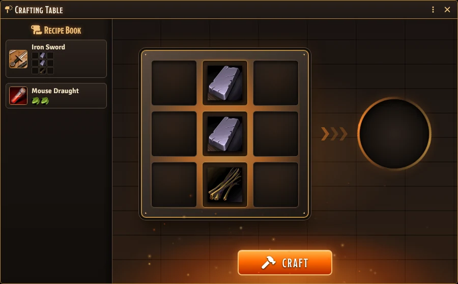
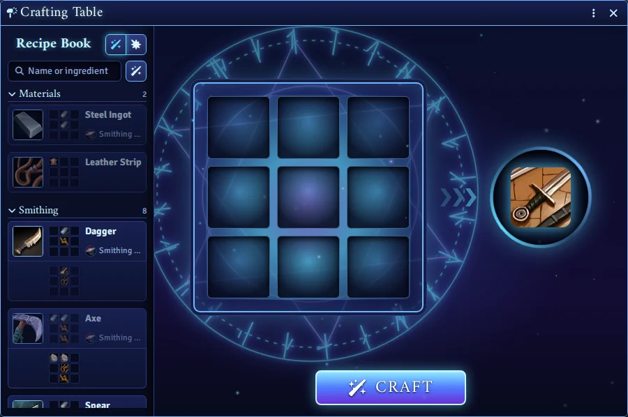
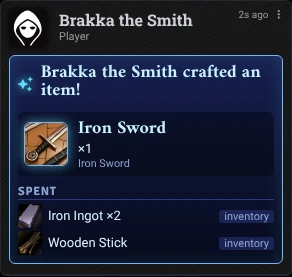
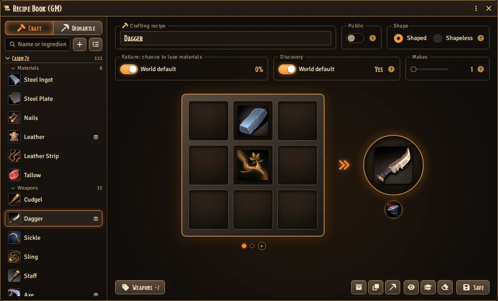
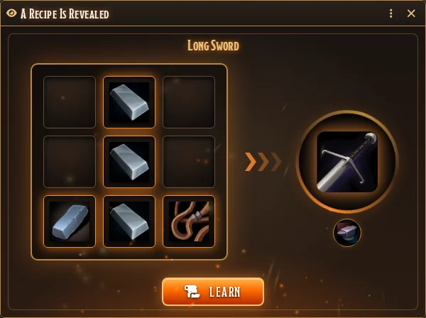

# Grid Crafter

**Lay the materials out on a 3×3 grid, strike, and forge something new — in any system.**



[](https://buymeacoffee.com/mestredigital) [](https://mestredigital.online/pages/projetos-en)

Crafting the way Minecraft taught everyone to do it: two iron ingots over a stick make a sword.
Put the right items in the right places, hit **Craft**, and watch the materials melt into
something new — with sparks, light and the ring of the anvil.

## ⚒️ Why?

The fighter wants a new sword. The player says *"I use the two iron ingots and the wood I found."*

And then the table stops. Is that even a recipe? The GM checks their notes, the player deletes the
ingots from the sheet by hand (or forgets to), someone creates the sword item, someone else asks
where the wood went. The moment that should feel like an achievement turns into bookkeeping.

**Grid Crafter turns it into a moment.** The GM sets up the recipes once. The players drag items
from their own sheets onto a crafting grid and try their luck. Get it right, and the ingots and
the wood leave the sheet, the sword appears on it, and the whole table sees it happen in chat.
Get it wrong, and the materials refuse to come together — and, if the GM wants, they might be
lost in the attempt.

## ✨ Key Features

* 🔲 **A real crafting grid.** Drag items from a character sheet, the Items directory or a
  compendium onto a 3×3 grid, move them between cells, and press **Craft**. Double-click any item
  to open its sheet.
* 🔥 **A spectacle, not a dialog.** The table shakes with three hammer blows, the materials fly
  into the heart of the grid, a flash of light travels into the result slot, and the new item
  bursts out of it. Failures flare red, shudder and smoke.
* 🌌 **Two looks for your table.** **Forge** — fire, sparks, riveted iron and the ring of the
  anvil. **Arcane** — runes, a turning magic circle and blue light. The GM picks one for everyone.

  

* 📐 **Shaped and shapeless recipes.** A shaped recipe cares where each item sits — and still
  works anywhere on the grid, or mirrored. A shapeless recipe only cares which items are there.
* 🎒 **Uses the real inventory.** Crafting spends one unit per grid cell from the character's own
  sheet, and the new item lands right on that sheet, stacking with any copies already there.
* 📖 **A recipe book for every player.** The first time a player forges something, its recipe is
  written into their personal recipe book. Next time, one click lays the recipe out on the grid
  from their inventory.
* 👁️ **Share a recipe, keep the secret.** From the GM's Recipe Book, **Share Recipe** shows the
  pattern to every player — the ingredients and their places, never what it makes. You describe
  the result; they have to remember the pattern.
* 🎲 **Failure can cost something.** Set a chance for a failed attempt to destroy the materials —
  for the whole world, or per recipe. Leave it at 0 and failure is free.
* 💬 **Every attempt reported in chat.** Success shows what was spent and what was made; failure
  shows what was tried. Items that came from the Items directory or a compendium instead of the
  character's sheet are tagged, so the table can tell a free craft from a paid one.

  

* 🗺️ **Straight to the map.** With [Canvas Loot](https://github.com/brunocalado/canvas-loot), drag
  the item you just forged from the crafting table onto the map, and it lands on the ground.
* 🔊 **Sounds you can swap.** Every theme comes with its own sounds for crafting, success, failure
  and shared recipes. The GM can replace any of them and set their base volume; each player hears
  them on their own Interface volume.
* 🧩 **Works with any system.** Choose which item types count as crafting materials (nobody forges
  a hammer out of a class), and tell the module where your system keeps an item's quantity.
* 🔌 **Recipe packs from other modules.** Module and system developers can ship ready-made recipe
  books through the [API](docs/API.md).

## 🛠️ How to Use

### For the GM — write the recipes

1. Open the **Items** directory and click **Recipes** at the top (or run `GridCrafter.recipes()`
   in a macro).
2. Click **New Recipe**. Drag the ingredients from the Items directory or a compendium onto the
   grid, and the item it makes onto the circle on the right.
3. Choose **Shaped** or **Shapeless**, how many items one craft **Makes**, and whether a failure
   uses the world's chance to lose materials or a chance of its own. Hover the **?** icons for a
   quick explanation.
4. **Save.**



To teach a recipe in play — the old smith shows the apprentice how it's done — open it and click
**Share Recipe**. Every player sees the pattern light up, cell by cell.



### For the GM — set it up once

All settings are in **Game Settings → Configure Settings → Grid Crafter**:

* **Recipes** — opens the Recipe Book.
* **Craftable Item Types** — which kinds of items can go on the grid. With none selected, every
  type is allowed.
* **Crafting Sounds** — the base volume and the sound for crafting, success, failure and shared
  recipes. Leave a sound empty to use the theme's own.
* **Visual Theme** — Forge or Arcane, for everyone at the table.
* **Quantity Path** — where your system keeps an item's quantity, such as `system.quantity`.
  Items without a number there are used up whole.
* **Failure: Chance to Lose Materials** — the world-wide default; each recipe can override it.

### For the players — forge something

1. Make sure your user has a character assigned (**User Configuration → Character**). Crafting
   uses that character's inventory, and the forged item goes to their sheet.
2. Open the Items directory and click **Forge** (or run `GridCrafter.forge()` in a macro).
3. Drag items from your character sheet onto the grid and arrange them. Right-click a cell, or
   use its small ✕, to empty it.
4. Press **Craft**.

Already know the recipe? Click it in your **Recipe Book** on the left, and the grid fills itself
from your inventory. A greyed-out recipe means you're missing something.

## 🔌 For Developers

Ship recipes with your module or system so they're ready the moment the GM enables it:

```js
Hooks.once("grid-crafter.ready", api => {
  api.registerRecipes("my-module", [
    {
      id: "iron-sword",
      cells: [
        [null, "Compendium.my-module.materials.Item.ironIngot000001", null],
        [null, "Compendium.my-module.materials.Item.ironIngot000001", null],
        [null, "Compendium.my-module.materials.Item.woodenStick00001", null]
      ],
      result: "Compendium.my-module.gear.Item.ironSword0000001"
    }
  ]);
});
```

👉 **[Read the full API documentation](docs/API.md)**

## 🚀 Installation

Requires Foundry VTT v14. Install via the Foundry VTT Module browser or use this manifest link:

```
https://github.com/brunocalado/grid-crafter/releases/latest/download/module.json
```

Optional: install [Canvas Loot](https://github.com/brunocalado/canvas-loot) too, so forged items
can be dragged straight onto the map.

## 🌍 Translations

Want to translate this module? It's easy:
1. Download the `lang/en.json` file.
2. Translate the values in the JSON file.
3. Open an issue on [GitHub](https://github.com/brunocalado/grid-crafter/issues).
4. Attach your translated file and tell us the `lang` and `name` it should use. For example:
   ```json
   "lang": "pt-BR",
   "name": "Portuguese (Brasil)"
   ```

## ⚖️ Credits

* **Code License:** GNU GPLv3.

* **Sounds:** mixed from [Kenney](https://kenney.nl)'s RPG Audio, Impact Sounds, Interface Sounds,
  Sci-fi Sounds and Digital Audio packs, released under
  [CC0](https://creativecommons.org/publicdomain/zero/1.0/). See `assets/sounds/CREDITS.md`.
